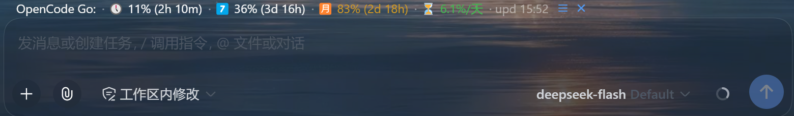
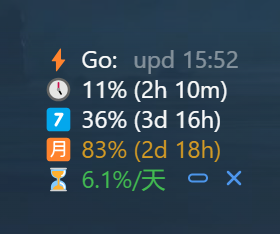

# dsh-opencode-go-usage

English | [中文](README.md)

[](./LICENSE)



A [DeepSeek Harness](https://github.com/deepseek-ai/deepseek-harness) (dsh) **bundle** that shows your [OpenCode Go](https://opencode.ai/docs/go/) subscription usage in the composer dock above the input bar (same spot as the built-in token stats).

It is the Web counterpart of [pi-ocgo-usage](https://github.com/v587d/pi-ocgo-usage) (a Pi plugin): percentage and reset countdown for the three usage windows (rolling 5h / weekly / monthly), color-coded by threshold, so you notice before a window runs out and requests get rate-limited.

```
OpenCode Go: 🕔 0% (2h 39m) · 7️⃣ 31% (2d 15h) · 🈷️ 62% (15d 18h) · ⏳ 2.4%/day · upd 16:10
```

Stacked layout (toggle it with the icon button on the chip; the choice is remembered):



```
⚡ Go: upd 16:10
🕔 0% (2h 39m)
7️⃣ 31% (2d 15h)
🈷️ 62% (15d 18h)
⏳ 2.4%/day
```

This repository is a customized fork of [v587d/dsh-opencode-go-usage](https://github.com/v587d/dsh-opencode-go-usage) (MIT). See [Differences from upstream](#differences-from-upstream).

## Features

- **Three windows** — rolling 5h / weekly / monthly percentage (**one decimal place**, matching the console) + reset countdown
- **Color thresholds** — normal → yellow warning (≥80%) → red error (≥90% or rate-limited)
- **Daily remaining** — `⏳ x.x%/day` derived from the monthly window, telling you the average you can spend per day (red <3%/day, yellow <5%/day)
- **Freshness** — `upd HH:MM` shows the last successful fetch time
- **Light polling** — polls every 10s (instant refresh when the tab regains focus); host-side 300s cache (configurable TTL) + 60s failure cooldown, so opencode.ai is not bothered too often
- **Provider-aware** — shown whenever the session's current model provider name contains `opencode` (case-insensitive); reads the live in-memory model selection (the `modelSelection` session projection, millisecond-fresh, no network) each poll, so `opencode-go`, `opencode-zen-go`, and future OpenCode routes appear automatically, while a provider without `opencode` hides within one poll interval; an unreadable provider (session not bound yet, upstream API drift) keeps the chip visible instead of hiding it
- **Floating chip** — the chip follows the composer input card frame-by-frame (rAF), keeping a fixed pixel offset from the card while the sidebar width changes or the page scrolls; drag it to fine-tune the position, click the lock button to pin it (position and lock state persist in localStorage)
- **Inline / stacked layouts** — the icon button on the chip toggles between the single inline line and a stacked card: `⚡ Go: upd HH:MM`, one line per window, then the `⏳` daily line, with the action icons moved to the last line; the stacked card keeps its bottom edge fixed and grows upward, so it never covers the composer. The choice persists in localStorage (`dsh.ocgoChip.layout`)
- **Click to expand** — the detail panel shows each window's reset countdown, a `set` editor for credentials at the bottom-left, and a manual `refresh upd HH:MM` at the right
- **Built-in credential editor** — no terminal needed: the `set` panel edits the workspace id and cookie directly (inputs show `••••` + last 4 chars; click outside / Esc / Save confirms the write)
- **Graceful degradation** — missing config shows `<err:noconfig>`, HTTP failures show `<err:httpXXX>`; clicking the chip in the error state opens the set panel directly
- **Cookie stays host-side** — the browser only talks to the same-origin `/api/ocgo-usage` JSON endpoints; the cookie never reaches the page

> **⚠️ An OpenCode Go session cookie is required.** The cookie is a full user session (not an API key) and can access everything in your OpenCode account. Treat it like a password — see [Configuration](#configuration).

## Differences from upstream

Relative to [v587d/dsh-opencode-go-usage](https://github.com/v587d/dsh-opencode-go-usage) (v0.1.0):

| Change | Description |
|---|---|
| Iconized window labels | `5h / wk / mo` text labels replaced with `🕔 / 7️⃣ / 🈷️` icons (the detail panel keeps full text) |
| Chip follows the input card | A rAF loop pins the chip to the card (`position: fixed` coordinates = card position + user offset); drag to move, lock button to pin; offset persisted under `dsh.ocgoChip.offset` (legacy `dsh.ocgoChip.pos` migrated once) |
| Daily remaining metric | `⏳ x.x%/day` derived from the monthly window, color-coded at <3%/<5% thresholds (new `segOk` style) |
| Percentage precision | Keeps one decimal place (upstream floored to integers): the fractional `usagePercent` is preserved, and a fractional `10.5%` inside the legacy `data-slot` text is parsed too, so the chip matches the percentage shown on the OpenCode console |
| Current OpenCode page parser | Supports serialized `rollingUsage` / `weeklyUsage` / `monthlyUsage` `$R[n]` objects and reads their live `usagePercent` and `resetInSec`; when present alongside legacy `data-slot` DOM, the live serialized value wins to avoid a stale monthly 100% shell |
| OpenCode provider wildcard | Shows the chip whenever the current provider name contains `opencode` (case-insensitive), covering `opencode-zen-go` and future OpenCode routes |
| Inline / stacked layouts | A layout toggle button on the chip switches between the inline line (default) and a stacked card (`⚡ Go: upd HH:MM` + one line per window + the `⏳` line, action icons on the last line); the stacked card is height-compensated so its bottom edge stays put while it grows upward; the choice persists under `dsh.ocgoChip.layout` |
| Runtime dependency fix | `@deepseek-ai/cordis` moved into `dependencies` (npm does not auto-install peer deps for `link:` installs, which previously broke startup) |
| DSH 0.1.5 compatibility fix | The session provider is now read from the `modelSelection` session projection (the old `connection.api.sessions.models` RPC was removed in DSH 0.1.5 and made the chip vanish silently); an unreadable provider no longer hides the chip |

## Requirements

- DeepSeek Harness `0.1.5-rc.1` or newer (web profile) — the provider read uses the `modelSelection` session projection; the old `connection.api.sessions.models` RPC was removed in 0.1.5
- `pnpm` on `PATH` (needed by `dsh plugin`)

## Installation

This is a standard dsh **bundle**: `package.json` declares `dsh.bundle` and it is installed via `dsh plugin --profile web add <spec>` (pnpm transformer), which adds it to the profile's `dsh.profile.bundles`. The repository ships prebuilt `lib/` artifacts, so **no build step or build permission is required** — following the official [publish guide](https://github.com/deepseek-ai/deepseek-harness/blob/master/docs/user/develop/basic/publish.md).

### From GitHub (recommended)

```sh
dsh plugin --profile web add github:ZIYE-JK/dsh-ocgo-usage
```

Because `lib/` is committed to the repository, pnpm installs the built package directly without asking for build-script permission.

### From tarball

```sh
pnpm pack            # inside this repo → dsh-ocgo-usage-0.1.3.tgz
dsh plugin --profile web add ./dsh-ocgo-usage-0.1.3.tgz
```

### Local development install

```sh
git clone https://github.com/ZIYE-JK/dsh-ocgo-usage.git
cd dsh-ocgo-usage
pnpm install
pnpm run build
dsh plugin --profile web add link:$(pwd)
```

**Restart `dsh web` and refresh the page** — the chip appears in the dock above the input bar. You can verify the plugin layer composes without starting:

```sh
dsh --profile web --dump-config   # should show a "# == dsh-ocgo-usage" layer
```

> **About the npm name:** the npm package name `dsh-ocgo-usage` (used by this plugin and its upstream) was squatted by a third-party plugin with similar functionality, so this repo is not published to npm; GitHub install is unaffected. If you see a same-named npm package elsewhere, it is not the artifact of this repository.

## Configuration

### Option 1: the in-UI `set` panel (easiest)

Click the chip to expand → `set` at the bottom-left → enter the workspace id and cookie (existing values show as `••••` + last 4 chars; focus the input to type a new value) → click outside / Esc / Save to confirm; it takes effect immediately.


### Option 2: environment variables (same names as pi-ocgo-usage)

```sh
export OPENCODE_GO_COOKIE="auth=Fe26.2*...; oc_locale=zh"
export OPENCODE_GO_WORKSPACE_ID="wrk_01XXXXXXXXXXXXXXXXXXXXXXXX"
```

### Option 3: config file

Write `$DSH_HOME/ocgo-usage.json` (default `~/.dsh/ocgo-usage.json`):

```jsonc
{
  "cookie": "auth=Fe26.2*...; oc_locale=zh",
  "workspaceID": "wrk_01XXXXXXXXXXXXXXXXXXXXXXXX"
}
```

```sh
chmod 600 ~/.dsh/ocgo-usage.json
```

Precedence: environment variables > config file > built-in defaults.

### Optional overrides

| Env var | Default | Description |
|---|---|---|
| `OPENCODE_GO_BASE_URL` | `https://opencode.ai` | API base URL |
| `OPENCODE_GO_CACHE_TTL` | `300` | host cache seconds, range 60–3600 |
| `OPENCODE_GO_TIMEOUT_MS` | `10000` | HTTP timeout |

Layer config (`~/.dsh/profiles/web/cordis.patch.yml`):

```yaml
- id: ocgo-usage
  config:
    enabled: false    # master switch, default true
```

> **Cookie expiry:** the `auth` cookie is issued with a 1-year validity. After it expires (or is revoked) the page 302-redirects to the login page and the chip shows `<err:http302>` instead of stale numbers. Re-login to opencode.ai and update the cookie through the set panel.

## Usage

Click the chip to expand the detail panel: each window shows its full name, percentage and reset countdown; `refresh upd HH:MM` at the bottom-right refreshes manually and shows the data time.


## How it works

- **Host half** (`src/index.ts`, `src/service.ts`, `src/api.ts`, `src/routes.ts`) — fetches `GET /workspace/<wrk>/go` with the cookie. It supports both legacy SSR `data-slot="usage-item"` blocks and current `rollingUsage` / `weeklyUsage` / `monthlyUsage` → `$R[n]` serialized objects, reading their `usagePercent` and `resetInSec`. When both formats are present, the live serialized value wins to avoid a stale monthly-100% DOM shell. The result is cached and served through the same-origin JSON endpoints `/api/ocgo-usage` (+ `/api/ocgo-usage/refresh`, `/api/ocgo-usage/config`).
- **Browser half** (`src/client/`) — registers the chip on the `conversation.composer.dock` slot, polls the host endpoint every 10s, and renders the three windows color-coded by severity. It is visible when the live provider in the `modelSelection` session projection contains `opencode` (case-insensitive); an unreadable provider keeps the chip visible instead of hiding it; the chip position is pinned to the input card frame-by-frame by the rAF follower in `src/client/OcgoDockEntry.tsx`. The chip has two layouts (inline and stacked, persisted under `dsh.ocgoChip.layout`); the stacked one is a five-line card with the action icons on its last line.

The browser never sees the cookie; fetching and parsing all happen host-side.

## Security

- The `auth` cookie is a **full OpenCode user session**. Anyone holding it can access every workspace, subscription and billing detail in your account.
- The plugin **never** logs the cookie, never puts it into error messages, never sends it to the browser.
- The config editor only writes new values to `$DSH_HOME/ocgo-usage.json` (chmod 600); the browser only ever sees the `••••` + last-4-chars masked view.

## Development

```sh
pnpm install
pnpm run build     # tsc -b && tsdown → lib/
pnpm run typecheck # tsc -b --pretty false
pnpm test          # vitest run (parser / config / service)
```

> **Client changes need no dsh web restart:** the host reads `/plugins/dsh-ocgo-usage/client.js` from disk live, so a browser refresh suffices after editing client code; host-side changes (`src/index.ts` etc.) require a restart.

The build config (`shared/tsdown.client.ts`) is adapted from [dsh-balance-meter](https://github.com/Ghost011118/dsh-balance-meter) (BSD-3-Clause), itself a copy of the official DSH `packages/client/tsdown.client.ts` — it produces the closure-factory artifacts that the web shell's module table (`window.__ModuleLoader__.load({id, factory})`) requires.

## Credits

- Upstream: [v587d/dsh-opencode-go-usage](https://github.com/v587d/dsh-opencode-go-usage) (MIT) — all base functionality of this repo comes from it
- [v587d/pi-ocgo-usage](https://github.com/v587d/pi-ocgo-usage) — the same plugin on the Pi platform, the behavioral baseline

## License

MIT — see [LICENSE](./LICENSE).
